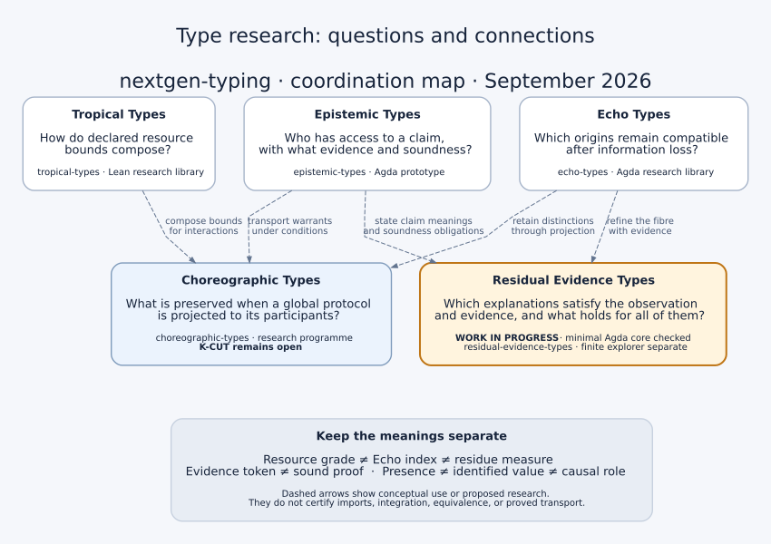

// SPDX-License-Identifier: MPL-2.0
// SPDX-FileCopyrightText: 2026 Jonathan D.A. Jewell <j.d.a.jewell@open.ac.uk>
= Type research: connections and shared meanings
:toc:
:icons: font

This is the shared reading guide for the five research families in the map.
It coordinates vocabulary and ownership; the owning repositories define
their formal interfaces and carry their proof evidence.

*Read every dashed arrow as a conceptual use or a proposed research task.*
An arrow does not assert a package dependency, a checked bridge, an
equivalence, or a theorem. Residual Evidence Types now has a checked minimal
Agda core and two narrow interface comparisons, described below with proof
receipts. Those results do not discharge every obligation represented by an arrow.

== What each family means

[cols="1,2,2",options="header"]
|===
|Family and owner |Question and object |Boundary

|https://github.com/hyperpolymath/echo-types[Echo Types]
|Which possible origins lie over an output after a transformation?
`Echo f y = Σ (x : A), f x ≡ y` retains a witness in the ordinary preimage
fibre. The research concerns structured information loss and retained distinctions.
|An output need not identify its actual origin. A numeric measure of a
residue does not determine the residue's structure.

|https://github.com/hyperpolymath/epistemic-types[Epistemic Types]
|From which standpoint is a claim available, and with what evidence?
`E κ A` indexes access to a claim by a standpoint; warrants record evidence,
and factivity or soundness requires additional structure.
|Possessing evidence is not automatically a proof of its claim. Belief,
knowledge and a sound warrant have different interfaces.

|https://github.com/hyperpolymath/tropical-types[Tropical Types]
|How do resource bounds compose? A declared resource algebra supplies
operations and laws: max-plus can combine alternatives with `max` and
sequential costs with `+`; bottleneck paths use a different algebra.
|The algebra and cost semantics must be stated. A bound is neither a
probability nor the identity of an information residue.

|https://github.com/hyperpolymath/residual-evidence-types[Residual Evidence Types]
|Which worlds satisfy both an observation and its evidence constraints?
`Candidate observe r E = Σ (w : W), (observe w ≡ r) × E w`.
Presence and value identification are questions over all admissible worlds.
|The world is not recovered just by constructing a candidate. Real-world
soundness also needs the premise that the actual world is admissible.
The formal library is work in progress.

|https://github.com/hyperpolymath/choreographic-types[Choreographic Types]
|What happens to retained distinctions, resource bounds and warrants when
a global interaction protocol is projected to local participants?
|The general K-CUT result is open in the reviewed project description.
A causal-order frontier called a cut is not Gentzen cut-elimination;
it is also not a statistical causal-identification result.
|===

These are complementary research questions, not successive ranks in a
universal hierarchy of type-system strength. They may be expressible using
ordinary dependent, refinement, modal or graded constructions. A name alone
does not establish a new primitive type or a novelty claim.

== Shared glossary

[cols="1,3",options="header"]
|===
|Term |Meaning in this guide
|Observation |The result of a declared observation function. Keeping only
its sign or magnitude changes that function and can merge distinctions.
|Fibre / fiber |Origins paired with evidence that the observation function
maps them to the specified output. The two spellings mean the same thing.
|Candidate world |One world with evidence of observation compatibility and
the declared constraints. It is an admissible explanation, not an assertion
that this world actually occurred.
|Residual |A discrepancy relative to a declared model. In the imported
example it is `r = u + n`. Additivity is an assumption of that example.
|Residue |Information retained after a transformation. An Echo residue is
not synonymous with a numerical residual or an error term.
|Evidence constraint |A predicate restricting candidate worlds. Choosing
a bound in an explorer does not establish that real observations obey it.
|Standpoint |The agent, observer or evidence state from which a claim is
available. It is an explicit index, not necessarily a probability.
|Warrant |Evidence for a claim from a standpoint. Soundness needs a separate
map from that evidence to the specified claim meaning.
|Soundness |A stated guarantee connecting evidence or a successful check to
the meaning of a claim, under explicit premises.
|Presence |Every admissible world has a nonzero contribution. A meaningful
case also requires evidence that at least one world is admissible.
|Value identification |The queried contribution has the same value in every
admissible world. This does not identify a source or its causal role.
|Confounding |A prospective causal specialisation, requiring a causal model
and its identification assumptions. An unresolved additive contribution alone
does not establish a confounder.
|Inconsistency |No candidate satisfies the declared model and constraints.
The explorer reports a conflict and issues no presence or identification claim;
it does not use an empty candidate set as a useful warrant for every claim.
|Resource grade |An element of a declared resource algebra used for compositional
usage or cost accounting. Which operations compose which behaviours is explicit.
|Echo index |An index of retained information or allowed degradation. It is
distinct from a resource grade and from a numerical measure of a residue.
|Residue measure |An observation of retained information into a measuring
domain. Equal measured values need not mean equal retained information.
|===

== What each connection asks us to establish

[cols="1,2,2",options="header"]
|===
|Connection |Conceptual relationship |Evidence needed for a stronger claim
|Echo → Residual Evidence
|Refine the observation fibre with the evidence predicate `E`.
|The first core checks an encoding into `Echo.Echo` and both round trips.
Coarsening and dependency-preserving composition laws remain open.
|Epistemic → Residual Evidence
|Make the meaning and evidence obligations of candidate-wide claims explicit.
|The first core checks a `SoundWarrant` for a candidate-wide claim, with an
inhabited case and explicit actual-world premises. Evidence revision and
retraction remain open.
|Echo → Choreographic
|Track the distinctions retained by projection to participants.
|A projection model and correspondence theorem. An informal loss number
cannot stand in for the structure of an Echo residue.
|Epistemic → Choreographic
|Transport warrants with declared standpoint and soundness conditions.
|The relevant K-CUT-WARRANT statement and its proof, including its side conditions.
|Tropical → Choreographic
|Compose bounds for interactions using a stated resource algebra.
|A grading semantics and a projection theorem. A result in another proof
assistant needs a proved correspondence or a port with its laws re-proved.
|===

The Choreographic README reviewed for this guide uses the phrase
"echo loss-grade". The Echo foundation contract explicitly separates Echo
indices, residue measures and resource grades. This map preserves that
distinction; reconciling the choreographic interface is an open coordination
task, not an equivalence asserted here.

== Where things belong

* `nextgen-typing`: this map, the shared glossary, ownership routing, comparisons
  and explicitly cross-project integration obligations.
* `residual-evidence-types`: the residual model, research plan, explorer,
  Agda core, and tests or proofs specific to that model.
* `echo-types`, `epistemic-types`, `tropical-types`, `choreographic-types`:
  each family's definitions, implementations and own proof evidence.
* `kategoria`: language-development experiments. It is a separate project
  from the old `katagoria` repository name, which GitHub now resolves to
  `ideas-to-alphas`.
* `typell`: verification-kernel implementation; `typed-wasm`: target and ABI
  work; `panll`: the consuming environment. A conceptual connection in this
  guide does not establish that any family is integrated into these projects.

The machine-readable ownership rules are in
link:../.machine_readable/bot_directives/placement.a2ml[placement.a2ml].

== First residual milestone: checked, with limits

The first argument is *presence without identification*. In natural numbers,
`u+n=2` alone admits both `(0,2)` and `(2,0)`. Adding `n≤1` proves `u≠0`,
but `(1,1)` and `(2,0)` still disagree on the value of `u`. Adding `u=0`
then makes the constraints inconsistent, so no inhabited case can be built.

The new core also checks ordinary evidence-refined fibre round trips,
conditional actual-world soundness, and claim transport under evidence
refinement. Three deliberately invalid modules must be rejected by Agda.
Both actual sibling interfaces are imported by the comparison modules:
Echo's fibre packaging round-trips, and Epistemic's `SoundWarrant` requires
explicit actual-world premises.

https://github.com/hyperpolymath/residual-evidence-types/blob/7ffd4d25a4f3f652f71311609be73e391b25c7cd/PROOF-STATUS.adoc[The proof record]
lists the theorem names, commands, pinned sibling revisions and standard-library
warnings. The https://github.com/hyperpolymath/residual-evidence-types/actions/runs/35781018563[hosted Agda proof job]
passed the core, all three rejection controls and both comparisons on 2026-09-22
for commit `938a7a5764ac18f08b1b7f332378b4d29c32aa37`, with the sibling pins at
the current `echo-types` (`9c4b72b5`) and `epistemic-types` (`dd948fbd`) heads,
inside a digest-pinned Debian 13 container with Agda 2.6.4.3 and no third-party
action. The first receipt, run 34400282291 on 2026-09-09, checked the same core
at the original pins.
This is newly written work; the separate starter archive mentioned in the
imported assessment has not been recovered.

Next, investigate dependency-preserving composition and evidence revision or
retraction, then prove correspondence with a finite checker. The JavaScript
explorer uses bounded signed integers and has no proved correspondence to the
natural-number core. Causal specialisations and probability adapters require
their own models and obligations.

== Sources and review boundary

Reviewed on 2026-09-09: the local README files for the six type-set projects
`echo-types`, `epistemic-types`, `tropical-types`, `choreographic-types`,
`kategoria` and `typell`; the imported residual assessment and explorer; and
the coordination repository's placement, architecture and roadmap documents.
The residual core and its two direct comparison modules were checked locally
and in the linked hosted job with Agda 2.6.4.3 under `--safe --without-K`.
This is a bounded result: the complete constituent proof suites were not
rerun, and unrelated local Epistemic work is outside the receipt.

Primary project entry points:

* https://github.com/hyperpolymath/echo-types[Echo Types README and foundation contract]
* https://github.com/hyperpolymath/epistemic-types[Epistemic Types README]
* https://github.com/hyperpolymath/tropical-types[Tropical Types README]
* https://github.com/hyperpolymath/choreographic-types[Choreographic Types README]
* https://github.com/hyperpolymath/residual-evidence-types/blob/main/residual-evidence-assessment.md[Imported residual assessment]

GitHub repository API lookups on that date resolved `tropical-resource-typing`
to `tropical-types` and `katagoria` to `ideas-to-alphas`, while `kategoria`
resolved to its own repository. The historical pipeline documents retain
the `katagoria` spelling; do not silently conflate it with `kategoria`.

The graphic is a checked-in SVG so it displays in the AsciiDoc README without
JavaScript or a diagram service. Its editable source is
link:images/type-connections.dot[type-connections.dot]. Rebuild it with
`just type-map` (Graphviz required).
